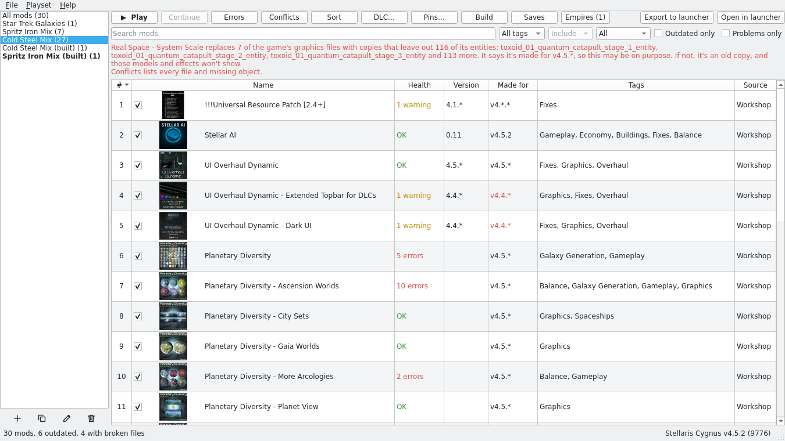
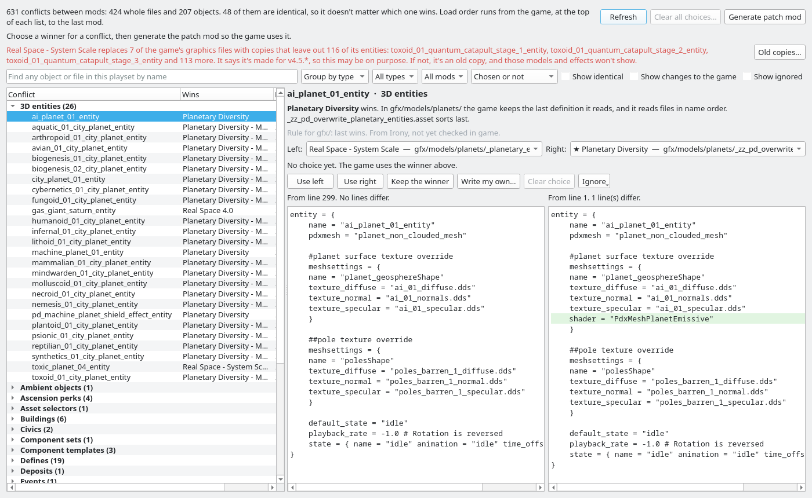
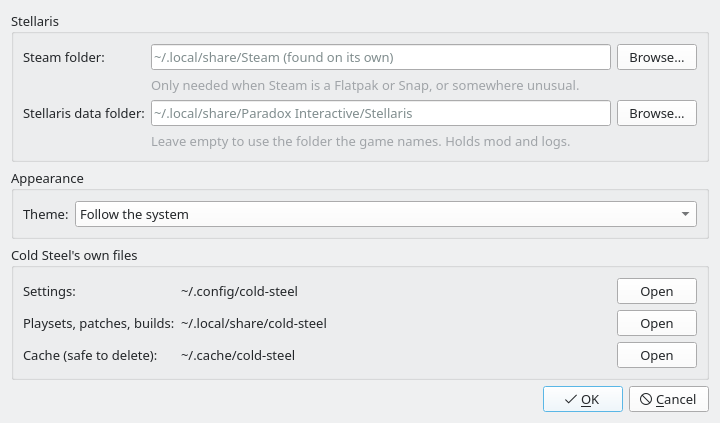

# Cold Steel

A mod manager for **Stellaris** that runs natively on Linux.

Cold Steel shows every mod you have installed and your playsets, all in one
fast window. It shows which mods are broken and where mods clash, helps you
fix the clashes, and starts the game. It's built for the native Linux version
of the game, so there's no Wine or Proton involved.

<picture>
  <source media="(prefers-color-scheme: dark)" srcset="screenshots/main-dark.png">
  
</picture>

## Install

You need **Arch Linux** (or an Arch-based distro such as CachyOS, EndeavourOS
or Manjaro), with Stellaris installed through Steam.

1. Download the package, `cold-steel-<version>-1-any.pkg.tar.zst`, from the
   [latest release](https://github.com/Spritzen/cold-steel/releases/latest).
2. Install it with pacman, from the folder you downloaded it to:

   ```sh
   sudo pacman -U ./cold-steel-*.pkg.tar.zst
   ```

   pacman also installs what Cold Steel needs, such as PySide6, from Arch's
   own repos.

Then start **Cold Steel** from your app menu (it's under Games), or run
`cold-steel` in a terminal.

**To update,** download the new release's package and install it the same
way. Your settings and playsets are kept.

**To remove it,** run `sudo pacman -R cold-steel`. Your playsets and settings
stay in the folders listed under [Your files are safe](#your-files-are-safe).
Delete those too if you want everything gone.

### Build the package yourself

If you'd rather not install a downloaded package, build it from the release's
source code:

```sh
sudo pacman -S --needed git base-devel
git clone https://github.com/Spritzen/cold-steel.git
cd cold-steel/packaging
makepkg -si
```

### Run from source

To try the latest code instead:

```sh
sudo pacman -S --needed git python pyside6 qt6-wayland python-msgspec python-xxhash
git clone https://github.com/Spritzen/cold-steel.git
cd cold-steel
make run
```

## First start

The first time it opens, Cold Steel shows what it reads and what it changes.
Then it finds Stellaris through your Steam libraries, even ones on other
drives, and lists your mods. It copies in the playsets you made in the
Paradox launcher.

**If it can't find Stellaris:** open **File › Settings** and choose your Steam
folder (the one holding `steamapps`). You'll need this if Steam is a Flatpak
or Snap, or somewhere unusual.

**Cold Steel needs the native Linux version of Stellaris.** If Steam Play
(Proton) is turned on for Stellaris, turn it off in the game's Steam
properties.

## Using it

### Playsets

A playset is a list of mods, in the order the game loads them. Pick one on the
left to see its mods. Then you can:

- **Turn mods on and off** with the tick box, and **drag** them into order.
- **Add mods** from **All mods**: select them, right-click, **Add to playset**.
  To see only the mods a playset doesn't have yet, choose it in the filter
  above the list (**Exclude** is picked for you).
- **Sort** puts mods that others depend on first, then follows common load-order
  rules.
- **DLC…** chooses which DLC the playset loads.
- **▶ Play** starts Stellaris with the playset. The Paradox launcher isn't needed.

The buttons under the list make, copy, rename and delete playsets. The
playset you last played is in bold.

### Find broken mods

Each mod has a **Health** column. **OK** means its files look fine. Click a
warning or error to see each problem, with the file and line: a localisation
file the game will ignore, a line it will skip, a stray `}` that cuts a file
short. Mods made for an older game version are shown in red under
**Made for**.

After you play, **Errors** reads the game's `error.log` and groups the errors
by the mod that caused them. When you start the game from Cold Steel, it reads
the log for you when the game closes.

### See and fix clashes

**Conflicts** shows every place two mods in the playset change the same thing:
a technology, an event, a line of text, or a whole file. It says which mod
wins and why, and shows the versions side by side with the differences
highlighted.

<picture>
  <source media="(prefers-color-scheme: dark)" srcset="screenshots/conflicts-dark.png">
  
</picture>

For each clash you can **use** either version, **keep the winner**, or
**write your own**. You can also **ignore** clashes you don't care about.
Then press **Generate patch mod**. Cold Steel writes your choices into a small
mod that loads last, so the game uses them. If a mod later changes something
you chose for, Cold Steel asks you to look at it again.

### Pin mod versions

A Steam update can change a mod halfway through a campaign. **Pins…** saves
a copy of the playset's Workshop mods as they are now, and plays those copies
until you say otherwise. When Steam has an update, Cold Steel tells you and
shows what changed. You can accept the update or keep your copy.

### Build one mod

**Build** merges the whole playset, with its patch mod, into one mod, and
makes a playset that plays just that mod. The build report shows where every
file came from. A built mod is for your own use only. It contains other
authors' work, so don't upload it.

### Share playsets

- **Playset › Import from launcher** and **Export to launcher** copy playsets
  between Cold Steel and the Paradox launcher.
- **Open in launcher** exports the playset, makes it the launcher's selected
  playset, then opens the Paradox launcher.
- **Save to file** and **Load from file** share a playset with a friend. The
  file uses the launcher's own format, and Irony Mod Manager's exports load
  too.

### Settings

**File › Settings** sets where Steam is, where Stellaris keeps its data, and
the theme. By default Cold Steel follows your desktop's light or dark theme.
It also shows where Cold Steel keeps its own files.

<picture>
  <source media="(prefers-color-scheme: dark)" srcset="screenshots/settings-dark.png">
  
</picture>

### Keyboard shortcuts

**Help › Keyboard shortcuts** (F1) lists them all. The main ones:

| Keys | Does |
|---|---|
| Ctrl+Enter | Play the selected playset |
| Ctrl+K | Conflicts |
| Ctrl+E | Errors from the last game |
| Ctrl+F | Search mods |
| Ctrl+N | New playset |
| Ctrl+D | Copy playset |
| F2 | Rename playset |
| Ctrl+L | Sort load order |
| Ctrl+B | Build one mod |
| F5 | Rescan mods |
| Ctrl+, | Settings |

## Your files are safe

Cold Steel never changes Steam's folders or your mods, and never downloads
anything. It changes Paradox's files only when you ask:

- **Play** writes `dlc_load.json`, which tells the game what to load. For a mod
  the launcher hasn't seen yet, it also adds the `.mod` file the game needs.
- **Export to launcher** and **Open in launcher** write the playset into the
  launcher's database.
- **Generate patch mod**, **Build** and **Pins** add their own mods to the
  game's `mod` folder, as links. Their names start with `cold_steel_`.
  Deleting the playset removes them.

Each Paradox file is backed up first, and nothing is written while the
launcher or the game is open.

| Folder | What's in it |
|---|---|
| `~/.config/cold-steel/` | Your settings |
| `~/.local/share/cold-steel/` | Your playsets, conflict choices, patch mods, pinned copies, builds, and backups of the Paradox files |
| `~/.cache/cold-steel/` | What it remembers about your mods, so it opens fast. Safe to delete |

## What it won't do

- **Download mods.** Subscribe to mods in Steam as usual. Cold Steel picks
  them up from there.
- **Run other Paradox games.** It's for Stellaris only.
- **Run on Windows or macOS.**

## For developers

Install the test and lint tools too:

```sh
sudo pacman -S --needed python-pytest python-pytest-qt python-pytest-benchmark ruff mypy
```

| Command | Does |
|---|---|
| `make check` | Lint, type-check and test. Run it before every commit |
| `make test` | Just the tests |
| `make bench` | Just the timing tests |
| `make format` | Fix formatting |
| `make package` | Build the Arch package from the last commit, and check it with `namcap` |
| `make screenshots` | Retake the screenshots above from your own install |

The tests use a small fake Stellaris install in `tests/fixtures/`, never your
own. The PKGBUILD is in `packaging/`.

### A desktop icon when running from source

The package adds Cold Steel to your app menu. When running from source, you
can add a desktop icon named `cold-steel-dev` instead. It stays out of the app
menu, so it never clashes with an installed package.

Run these commands inside the `cold-steel` folder. They were tested on
CachyOS with KDE Plasma, and use the standard desktop file format, so other
desktops should work too.

```sh
install -Dm644 src/cold_steel/data/cold-steel.svg \
  ~/.local/share/icons/hicolor/scalable/apps/cold-steel.svg

cat > ~/Desktop/cold-steel-dev.desktop <<EOF
[Desktop Entry]
Type=Application
Name=cold-steel-dev
Comment=Cold Steel, run from source
Exec=env PYTHONPATH=$PWD/src python3 -m cold_steel
Path=$PWD
Icon=cold-steel
Terminal=false
EOF
chmod +x ~/Desktop/cold-steel-dev.desktop
```

If you move the `cold-steel` folder later, run the commands again from its
new place.

## Licence

[MIT](LICENSE).

Cold Steel is inspired by
[IronyModManager](https://github.com/bcssov/IronyModManager), which was the
manager I used for years on Windows. Big props to Mario!
